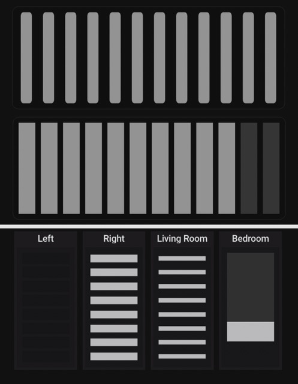

# Venetian Blinds & Roller Shades Card 🎨

A premium, flat-design visual integration card designed for Home Assistant to represent blind states. This card supports not only traditional **Venetian blinds** but also **Single Roller/Honeycomb shades** and premium **Double Honeycomb shades (Day/Night shades)**, featuring a built-in graphical UI visual editor.

---
## Preview



## ✨ Key Features

* **Multiple Types**: Supports `Venetian`, `Roller`, or `Double Honeycomb` display modes.
* 📐 **Visual UI Editor**: Aligned with modern 2026 Home Assistant components. Completely skip YAML with sliders to customize thickness, count, corner radius, and display proportions.
* 🎨 **Premium Color Groups**: Unique collapsible color controls supporting palettes and independent "Opacity" sliders for fine-tuning.
* 🧠 **Smart Physical Interaction**: In double-layer mode, it automatically calculates the boundary between the main height and the upper layer ratio, perfectly simulating realistic mechanical movement.
* ⚡ **Advanced Action Handling**:
  * **Tap**: In double-layer mode, quickly toggle the upper layer between 0%/100% or pop up middle rail controls; in single-layer mode, control full open/close.
  * **Hold**: Press and hold anywhere for 0.5s to accurately trigger the official `More Info` console of the primary entity.
* 💎 **Geometric Aesthetic**: Half-sized font spacing, perfectly aligned container and fabric corner radii, and zero-gap rendering for roller modes.

---

## 🛠️ Installation

### Method A: Manual Installation
1. Download the compiled `dist/venetian-blinds-card.js` from this project.
2. Upload the file to your Home Assistant configuration directory under the `www/` folder (e.g., `/config/www/venetian-blinds-card.js`).
3. Go to Home Assistant **Settings -> Dashboards -> Three-dot menu (top right) -> Resources**.
4. Click "Add Resource", enter the following, and save:
   * **URL**: `/local/venetian-blinds-card.js?v=1.0.0`
   * **Resource Type**: `JavaScript Module`

---

## ⚙️ Configuration

While this card supports 100% graphical configuration via the UI, if you prefer using YAML for advanced setups, the parameters are as follows:

| Name | Type | Default | Description |
| :--- | :--- | :--- | :--- |
| `type` | string | **Required** | Must be `custom:venetian-blinds-card` |
| `entity` | string | **Required** | Primary cover entity ID (controls overall height) |
| `blind_type` | string | `venetian` | Blind type: `venetian`, `roller`, `double_honeycomb` |
| `secondary_entity` | string | optional | Used in double mode: entity ID for the upper layer ratio |
| `name` | string | optional | Custom display name (defaults to entity's friendly name) |
| `show_name` | boolean | `true` | Whether to show the title at the top of the card |
| `orientation` | string | `horizontal` | Direction of operation: `horizontal`, `vertical` |
| `card_padding` | number | `16` | Padding between the frame and card edge (px) |
| `slat_count` | number | `12` | Venetian only: total number of slats |
| `slat_height` | number | `12` | Venetian only: thickness of each slat (px) |
| `slat_gap` | number | `4` | Venetian only: gap between slats (px) |
| `slat_corner_radius` | number | `2` | Radius for the integrated blind and container edges (px) |
| `tap_action` | string | `more-info` | Tap behavior: `more-info`, `open`, `sloped`, `none` |

### 🎨 `colors_group` Advanced Color Parameters

```yaml
colors_group:
  slat_color: [149, 165, 166]            # 1. Color of fabric/lowered slats (RGB array)
  slat_opacity: 1.0                      # Fabric opacity (0.0 ~ 1.0)
  slat_background_color: [255, 255, 255] # 2. Hidden slats/Lower layer color in double mode
  slat_background_opacity: 0.03          # Hidden/Lower layer opacity
  container_background: [0, 0, 0]        # 3. Inner frame/container background
  container_opacity: 0.15                # Container opacity
  card_background: [28, 28, 30]          # 4. Outermost card background
  card_opacity: 1.0                      # Card background opacity
```

### 💡 YAML Examples
1. Premium Double Honeycomb Configuration
```yaml
type: custom:venetian-blinds-card
blind_type: double_honeycomb
entity: cover.living_room_blind_height     # Controls overall height
secondary_entity: cover.living_room_blind_day # Controls upper layer ratio
name: Living Room Double Blind
show_name: true
card_padding: 16
slat_corner_radius: 12
tap_action: open                           # Tap to toggle day shade, hold for More Info
colors_group:
  slat_color: [240, 240, 240]
  slat_opacity: 0.45                       # Elegant translucent feel
  slat_background_color: [44, 62, 80]
  slat_background_opacity: 1.0             # 100% Blackout fabric
```

2. Minimalist Flat Venetian Configuration
```yaml
type: custom:venetian-blinds-card
blind_type: venetian
entity: cover.bedroom_blind
show_name: false                           # Hide text for minimalist style
slat_count: 16
slat_height: 8
slat_gap: 5
slat_corner_radius: 4
tap_action: sloped                         # Tap to tilt slats/let light in
```

---

📄 **License**
This project is released under the [MIT License](LICENSE). Feel free to fork, modify, and submit Pull Requests!
